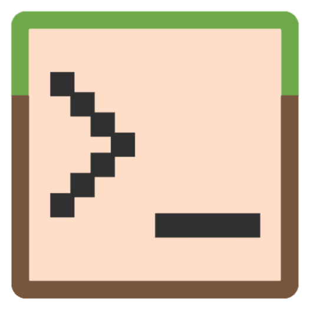

### A Minecraft Bedrock Function interpreter and shell written in Python
***
# FAQ
## What is it?
It is a interpreter and shell for running Minecraft Bedrock functions and commands. It allows you to write command line programs just using Minecraft commands, essentially making it into a programming language! It has a few added features but at its core, it is the same as it is in Minecraft.

## How does it work?
When you use MCF, you create a virtual Minecraft world. You can interface with this Minecraft world, using the same command syntax as if you were really playing Minecraft.

## What can it do?
Many of the core Minecraft features have been implemented into MCF. These include: Manipulating Blocks, Manipulating Entities, Manipulating Scoreboards. I have also added some custom syntax to allow users to read from standard input (Using /scoreboard) and write to standard output. (Using /say)

## What can't it do?
At the moment, there is no ability to make any system calls except reading from STDIN and writing to STDOUT. MCF is turing complete though, so go nuts!
***
# Installation and Use
## Download 
- **[MCF V1.0.0-beta2 for Windows](https://github.com/byAdam/MCF/releases/tag/V1.0.0-beta2)**

## Using MCF
When you install MCF, it adds "mcf" as a command to command prompt. 
You can run a function on the interpreter by specifying the path of the file as a command line argument. The directory of the function will act as the root directory. If no path is specified, the interpreter will enter the shell.
There is also a number of flags you can specify:
- -h, --help: Will output a list of valid arguments
- -r,--read: Will read world.json in the base directory
- -w,--write: Will write to "world.json" in the base directory on exit
- -l,--loop: Will run the function 20 times per second until you exit
- -d,--dir: Will set the base directory
  - Use in the form "-d=DIRECTORY"
  - By default, the base directory will be the directory of the called function

## Bugs and Issues
Please report any bugs and issues you find [here](https://github.com/byAdam/MCF/issues). This is a pre-release so there is likely to be many issues! If you have any questions or queries, feel free to contact me by email (adambrady2000@gmail.com) or on [Twitter](https://twitter.com/byAdam_Net)
***
# Technical Details

## Implemented Commands
- /setblock
- /fill
- /summon 
- /kill
- /tp
- /execute
- /function
- /tag
- /scoreboard
- /say

## Implemented Selectors
- @a
- @e
- @p
- @r
- @s

## Implemented Selector Arguments
 - x, y, z
 - dx, dy, dz
 - r, rm
 - name
 - scores
 - tag
 - type
 - c

## Custom Syntax
scoreboard players input \<target> \<objective>
- This command will read a line from STDIN
- The input will be saved as a score to the targets for that objective
- If the line is an integer, the input will the integer
- If the line consists of a single UNICODE character, the input will be the UNICODE code of the character
- If the line is blank, the input will be 0
- If the line consists of more than one UNICODE character, an error will be raised
- E.G scoreboard players input @a example

say
- say writes a line to STDOUT
- SELECTOR\*OBJECTIVE = Returns the score for the objective for the target entities
  - E.G @a\*example
- SELECTOR#OBJECTIVE = Returns the UNICODE Character corresponding to the score for the objective for the target entities
  - E.G @a#example
- $(x,y,z) = Returns block and data value at those coordinates in the form "block:data"
  - E.G $(0,~5,10)

exit
- Will exit the program

debug \<target> \[prefix]
- Will output the entity data for all targeted entities
- The prefix will be at the start of the line before the data, by default, it is "DEBUG"

## Structure
### World
A world consist of: Blocks, Entities, Scoreboard Objectives
### Entity
An entity consist of: position, uuid, type, name, tags
### Block
A block consists of: a position, identifier, data value
### Scoreboard Objective
A scoreboard objective consits of: entities with a non-null score
